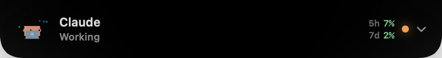
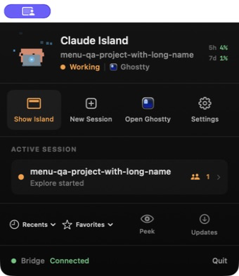
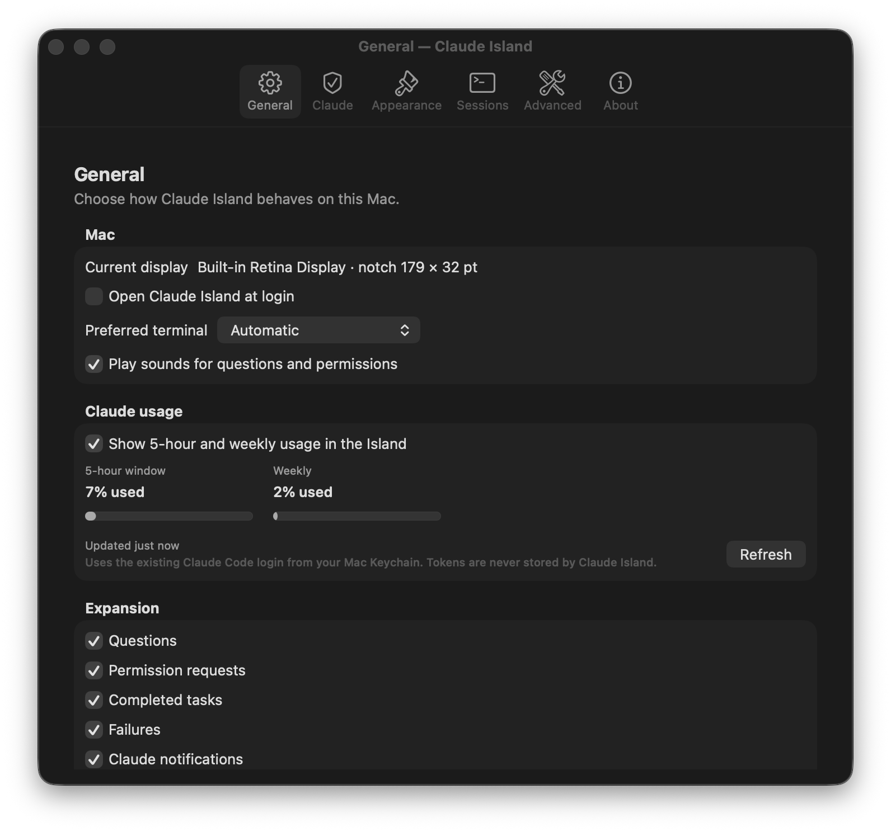

# Claude Island

Native macOS control surface for Claude Code, attached to the MacBook notch or
the top edge of displays without one.



Claude Island monitors Claude Code sessions through the documented hook
protocol, surfaces questions and permission requests, tracks multiple sessions
and subagents, and lets you return to the terminal that started the work. The
app is built with SwiftUI and AppKit and has no project-operated backend or
telemetry service.

[Website](https://claude-island.686f6c61.dev) ·
[Releases](https://github.com/686f6c61/clawd-island/releases) ·
[Changelog](CHANGELOG.md) ·
[Security](SECURITY.md)

> **Pre-release:** the source is public, but an official download is published
> only after Developer ID signing, notarization, and update-feed verification
> succeed. Do not redistribute ad-hoc development builds as official releases.

## Highlights

- Live session, tool and nested-subagent activity from Claude Code hooks.
- Direct answers to `AskUserQuestion` and permission requests from the Island.
- Attention-aware monitoring for multiple concurrent terminals and sessions.
- Native geometry measured from each display; no hard-coded Mac model table.
- Ghostty, Terminal, iTerm2 and Warp integration for new and resumed sessions.
- Five-hour and weekly Claude usage after the first real Claude activity.
- Configurable idle hiding, mascot peeks, sounds, motion and appearance.
- Signed Sparkle updates for notarized public builds.



## Screenshots

| Native app menu | Settings |
| --- | --- |
|  |  |

## Requirements

- macOS 14 Sonoma or later.
- Claude Code installed and signed in.
- Apple Silicon or Intel. The public packaging gate requires both the app and
  bundled hook helper to be universal before a release is published.

Claude Island is distributed directly and is not a Mac App Store application.

## Build locally

```sh
swift test
./scripts/build-app.sh
```

Install the local ad-hoc build for development:

```sh
./scripts/install.sh
```

This installs `Claude Island.app` under `~/Applications`. On first launch the
app copies its hook helper to its private Application Support directory and
merges Claude Island handlers alongside existing Claude Code hooks.

## Security and privacy

- Hook traffic stays on `127.0.0.1` and uses mutual HMAC-SHA256 authentication,
  request freshness, nonce replay rejection and signed responses.
- Claude Island does not upload prompts, commands, transcripts or paths to a
  Claude Island service.
- If usage display is enabled, the app reads the existing Claude Code Keychain
  credential only after real Claude activity. It does not store the OAuth token.
- Claude settings changes are explicit, merged idempotently and backed up.
- If the app is unavailable, the hook helper exits safely and Claude Code keeps
  its ordinary terminal interaction.

See the [security architecture](docs/SECURITY-ARCHITECTURE.md),
[threat model](docs/THREAT-MODEL.md), and [security policy](SECURITY.md).
Please use GitHub private vulnerability reporting rather than a public issue
for suspected security defects.

## Contributing

Read [CONTRIBUTING.md](CONTRIBUTING.md) before opening a pull request. Run the
test suite, keep changes focused, and never include real Claude transcripts,
credentials or private project data. Contributions require acceptance of the
[CLA](CLA.md).

## License

Claude Island is **source available**, not Open Source, under the
[Business Source License 1.1](LICENSE). Personal use, qualifying independent
professional use, and production use by qualifying small organizations are
free under the Additional Use Grant. See [LICENSING.md](LICENSING.md) for
examples and `LICENSE` for the controlling terms.

The app is created pseudonymously by
[686f6c61](https://twitter.com/686f6c61).

Claude and Claude Code are trademarks of Anthropic PBC. Claude Island is an
independent third-party project and is not affiliated with, sponsored by, or
endorsed by Anthropic.

The Clawd artwork is derived from
[clawd-pet](https://github.com/abderrahimghazali/clawd-pet) under the MIT
License. Sparkle and all other bundled third-party components retain their own
licenses. See [THIRD_PARTY_NOTICES.md](THIRD_PARTY_NOTICES.md).
