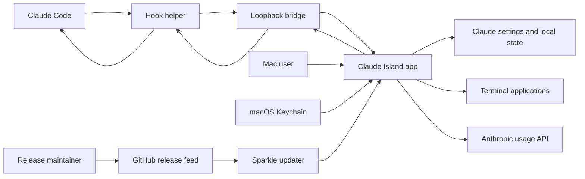

# Claude Island threat model

Last reviewed: 20 July 2026

## Executive summary

Claude Island has no internet-facing server, but it creates a security-critical
local path between Claude Code and a GUI that can approve tool use. The highest
risk is compromise of the mutually authenticated loopback bridge or its private
credential, followed by compromise of the signed update chain. File integrity, bounded
parsing, credential handling, and local metadata are secondary concerns. No
critical remote vulnerability was established in this review.

## Scope and assumptions

In scope:

- `Sources/ClaudeIsland/`
- `Sources/ClaudeIslandCore/`
- `Sources/ClaudeIslandHook/`
- `Resources/Info.plist`
- `Package.swift` and `Package.resolved`
- `scripts/build-app.sh` and `scripts/package-release.sh`

Runtime assumptions validated from the product requirements and repository:

- one interactive macOS user runs the app and Claude Code;
- public binaries will be distributed outside the Mac App Store;
- there is no Claude Island backend, telemetry collector, account system, or
  remote administration channel;
- the only expected runtime network activity is loopback hook traffic and
  outbound HTTPS to Anthropic and GitHub/Sparkle;
- prompts, commands, paths, permission decisions, and OAuth credentials are
  sensitive even on a single-user developer Mac.

Out of scope: Anthropic's implementation, terminal application internals,
GitHub infrastructure, Apple notarization infrastructure, physical compromise,
and an attacker who already has unrestricted control of the user's account.

Open questions that would require a new ranking: a future hosted website or
license service, enterprise fleet management, a shared macOS account, remote
desktop use, or loading user-provided mascot/web content.

## System model

### Primary components

- Claude Code invokes `ClaudeIslandHook` with JSON on stdin.
- The helper enriches the event and posts it to the loopback `HookServer`.
- `HookServer` decodes the event and hands it to `IslandStore`.
- The user approves, denies, or answers through the island; the decision
  returns on the original request to Claude Code.
- Settings managers install the helper and merge configuration under
  `~/.claude`.
- `ClaudeUsageClient` reads a Claude Code credential from Keychain and calls
  Anthropic directly.
- Sparkle reads an appcast from GitHub and verifies signed updates.
- Release scripts build, sign, notarize, and package public artifacts.

### Data flows and trust boundaries

- **Claude Code → helper:** hook JSON via stdin; trusted local producer by
  intent, but no cryptographic identity check; JSON shape is decoded after the
  helper adds terminal environment data. Evidence:
  `Sources/ClaudeIslandHook/ClaudeIslandHookMain.swift:8-24`.
- **Helper → app:** prompts, commands, paths, session metadata, questions, and
  permission requests over HTTP to fixed loopback port 47835. Both sides use a
  private per-install HMAC key, request nonces, freshness checks, replay
  rejection and signed responses. Evidence:
  `Sources/ClaudeIslandCore/HookBridgeAuthentication.swift`,
  `Sources/ClaudeIsland/HookServer.swift`,
  `Sources/ClaudeIslandHook/ClaudeIslandHookMain.swift`.
- **App → helper → Claude Code:** approval, denial, or answer JSON over the
  original HTTP connection and helper stdout; integrity depends on reaching
  the authentic app listener. Evidence: `Sources/ClaudeIsland/IslandStore.swift:309-356`,
  `Sources/ClaudeIslandCore/HookDecision.swift`.
- **App ↔ user filesystem:** helper installation, settings merges, backups, and
  Warp YAML under current-user paths; atomic writes exist for settings but
  there is no explicit file-owner or symlink policy. Evidence:
  `Sources/ClaudeIslandCore/HookSettingsInstaller.swift:19-66`,
  `ClaudeSettingsManager.swift:161-182`.
- **App → terminal apps:** directory and session ID cross into shell,
  AppleScript, YAML, or custom URL handlers; project-provided quoting is the
  primary validation. Evidence: `Sources/ClaudeIsland/TerminalActivator.swift:47-166`,
  `Sources/ClaudeIslandCore/ClaudeTerminalCommand.swift:3-17`.
- **Keychain → app → Anthropic:** bearer token is read through Security.framework
  only after observed Claude activity and sent over HTTPS using an ephemeral URL session; no project backend is in
  the flow. Evidence: `Sources/ClaudeIsland/ClaudeUsageClient.swift:5-62`.
- **GitHub → Sparkle → app bundle:** appcast and archive cross the internet
  over HTTPS and are expected to be checked with the configured EdDSA key;
  public releases also depend on Developer ID and notarization. Evidence:
  `Resources/Info.plist:33-44`, `scripts/package-release.sh:16-53`.

#### Diagram

## Assets and security objectives

| Asset | Why it matters | Security objective (C/I/A) |
| --- | --- | --- |
| Hook prompts and tool inputs | Can expose source, commands, paths, and user intent | C, I |
| Permission decisions and answers | A forged decision can change what Claude Code is allowed to do | I, A |
| Claude OAuth access token | Could expose account usage or enable unauthorized API activity within token scope | C, I |
| Claude settings and hooks | Control permission defaults and executable commands | I, A |
| Session IDs and working paths | Reveal project names and allow session resume attempts | C, I |
| Release signing and Sparkle keys | Protect every downstream installation | C, I |
| App and helper binaries | Execute with the current user's access | I, A |
| Update availability | Security fixes must reach users reliably | A |

## Attacker model

### Capabilities

- A malicious or compromised process running as the same macOS user can bind
  or connect to loopback ports and read or modify many user-owned files.
- A hostile webpage can attempt cross-origin requests to loopback services but
  normally cannot read responses without CORS permission.
- An attacker may control hook JSON only after compromising or influencing a
  local Claude Code workflow, plugin, hook, terminal environment, or helper
  endpoint.
- A supply-chain attacker may target GitHub, CI secrets, signing credentials,
  dependencies, release artifacts, or appcast publication.
- A user may be socially engineered into selecting dangerous permission modes
  or approving a misleading request.

### Non-capabilities

- The loopback listener is not reachable directly from another host under the
  intended configuration.
- No unauthenticated project-operated internet API, cloud database, or tenant
  boundary exists.
- A remote website cannot normally read loopback responses without a separate
  browser or server defect.
- The model does not treat an attacker with full control of the macOS account
  as preventable by this app alone.

## Entry points and attack surfaces

| Surface | How reached | Trust boundary | Notes | Evidence |
| --- | --- | --- | --- | --- |
| Hook stdin | Claude Code invokes helper | Claude Code → helper | Arbitrary JSON size is read to EOF before parsing | `Sources/ClaudeIslandHook/ClaudeIslandHookMain.swift:8-15` |
| Loopback HTTP listener | TCP 127.0.0.1:47835 | Local process/browser → app | Mutual HMAC authentication, freshness, replay rejection and strict method/path/origin validation | `Sources/ClaudeIsland/HookServer.swift`, `Sources/ClaudeIslandCore/HookBridgeAuthentication.swift` |
| HTTP parser | Bytes on accepted connection | Local network bytes → decoder | Headers, body and total request size are bounded; transfer encoding and duplicate headers are rejected | `Sources/ClaudeIsland/HookServer.swift` |
| Hook decisions | Island buttons | User → Claude Code | High-integrity user action tied to pending request order | `Sources/ClaudeIsland/IslandStore.swift:309-356` |
| Settings files | Startup and Settings Apply | App → user filesystem | Backups and atomic writes; no explicit owner/link validation | `Sources/ClaudeIslandCore/HookSettingsInstaller.swift`, `ClaudeSettingsManager.swift` |
| Terminal launch | Settings/session controls | App → shell/AppleScript/YAML/URL | Values quoted; supported terminal handlers execute local commands | `Sources/ClaudeIsland/TerminalActivator.swift:47-166` |
| Keychain credential | Usage refresh | Keychain → process → HTTPS | Token exists in process memory; not intentionally persisted | `Sources/ClaudeIsland/ClaudeUsageClient.swift:41-62` |
| Sparkle update | Automatic/manual check | Internet/release account → app | EdDSA key configured; release process is security-critical | `Resources/Info.plist:33-44` |
| SVG WebView | Bundled mascot state | App bundle → WebKit | Non-persistent store; only bundled SVG currently loaded | `Sources/ClaudeIsland/ClawdStateView.swift:26-69` |

## Top abuse paths

1. **Attempt to impersonate the island:** a local process binds port 47835
   before launch → the real app cannot listen → the helper sends only a signed
   proof, never the secret → the impostor cannot create the required signed
   response and the helper discards its decision.
2. **Inject a fake prompt:** a hostile webpage or local process posts crafted
   JSON to the real bridge → the island displays a plausible permission or
   question → the user is misled or the pending-request queue is disrupted.
3. **Exhaust the bridge:** a local client sends an incomplete request or a very
   large declared body → the parser keeps buffering or holds connections → the
   island consumes memory and genuine hooks time out.
4. **Tamper with hook persistence:** a local process modifies the copied helper
   or Claude hook configuration → Claude Code executes attacker-selected local
   code or sends events to another destination.
5. **Compromise a release:** an attacker steals GitHub, CI, Sparkle, or Developer
   ID credentials → publishes a malicious app/archive/appcast → users install
   code under the current macOS account.
6. **Exploit a quoting regression:** attacker-controlled directory or session ID
   reaches a shell, AppleScript, YAML, or URL context without the appropriate
   escaping → unintended commands execute when the user launches a session.
7. **Extract usage credentials:** malware reads process memory, intercepts the
   Keychain command output, or replaces a trusted executable in an unexpected
   environment → OAuth token confidentiality is lost.
8. **Recover local metadata:** another process or person with user-profile
   access reads defaults → learns recent repository paths and session IDs.

## Threat model table

| Threat ID | Threat source | Prerequisites | Threat action | Impact | Impacted assets | Existing controls (evidence) | Gaps | Recommended mitigations | Detection ideas | Likelihood | Impact severity | Priority |
| --- | --- | --- | --- | --- | --- | --- | --- | --- | --- | --- | --- | --- |
| TM-001 | Malicious local process | Can bind fixed loopback port before the app or connect as a local client | Attempt to impersonate the bridge or replay traffic | Availability loss; confidentiality/integrity only if the private credential or helper is also compromised | Hook data, decisions, settings | Mutual HMAC request/response authentication, private credential, 30-second freshness and replay rejection (`HookBridgeAuthentication.swift`, `HookServer.swift`, `ClaudeIslandHookMain.swift`) | Same-user malware may read or replace user-owned security material | Prefer code-identity-aware XPC as a future hardening layer; monitor bind failure and credential/helper integrity | Surface bind failure and count redacted authentication/replay failures | Low | High | low |
| TM-002 | Hostile webpage or local process | Can send requests to loopback but cannot read the private bridge credential | Inject fake hook events or queue misleading prompts | UI integrity loss, social engineering, pending-request disruption | User attention, decisions, availability | Mutual HMAC authentication; exact `GET /health` and `POST /hook` routes; JSON media type; browser-origin rejection; strict duplicate and transfer-encoding handling (`HookServer.swift`) | A compromised same-user process may read the credential; event-name allowlisting and a global pending-decision cap can be tightened | Keep the credential private, reject unknown event types where compatible, and cap pending requests globally | Count redacted authentication, origin and schema failures without logging payloads | Low | Medium | low |
| TM-003 | Local client | Can open loopback connections | Stream oversized or incomplete headers or bodies | Held connections or genuine hook timeout | App and hook availability | 16 KiB header, 1 MiB body and total request limits; exact content length; oversized/malformed requests receive 4xx (`HookServer.swift`) | No explicit per-connection read deadline or global active-connection cap | Add read deadlines and a small global connection limit if availability testing demonstrates need | Track connection count, rejected sizes and timeouts without payloads | Low | Medium | low |
| TM-004 | Local process or filesystem race | Same-user write access or opportunity during install/update | Replace helper or alter settings/hooks | Persistent execution or changed Claude permission behavior | Helper binary, Claude settings | Private `0700` support directory, `0600` credential, regular and bounded helper source, SHA-256 verification after copy, exact owned-command uninstall, backups and atomic settings writes (`HookBridgeCredential.swift`, `HookSettingsInstaller.swift`) | Fully compromised same-user code can still replace user-owned files after installation | Validate the installed helper signature in diagnostics and evaluate identity-aware IPC for a future architecture | Diagnostics should report helper hash, signature state, file owner/mode, and exact registered command | Low | High | low |
| TM-005 | Supply-chain attacker | Compromises repository, CI, signing secrets, dependency source, or release workstation | Publish malicious signed or misleading update | Code execution across installed user base | Release keys, binaries, update channel | Exact Sparkle pin, EdDSA update verification, SHA-pinned read-only CI, universal-binary checks, explicit nested signing order, mandatory Hardened Runtime/notarization/stapling/Gatekeeper, clean version staging and checksums (`Package.resolved`, `.github/workflows`, `package-release.sh`) | No public release attestation or standards-compliant SBOM yet; the Developer ID/notary gate has not completed a production run | Enable protected immutable releases; export SPDX SBOM and provenance; keep release secrets off PR workflows; test updates from the prior version | Immutable-release verification, checksums, GitHub security alerts, retained notary ID and key-use monitoring | Low | High | medium |
| TM-006 | Malware or hostile local tooling | Can inspect process memory or influence the local account | Capture OAuth credential while read or used | Account/token misuse within granted scope | OAuth token | Direct Security.framework access after Claude activity, ephemeral HTTPS session, no intentional persistence/logging, bounded credential data (`ClaudeUsageClient.swift`) | Token is briefly materialized as `Data` and `String` in process memory | Minimize token lifetime/copies, redact all errors, document Keychain ACL expectations | Detect unexpected usage errors and revoke through Claude Code/Anthropic account controls | Low | High | low |
| TM-007 | Crafted folder or session identifier | Value reaches a supported terminal launch path | Break out of shell/AppleScript/YAML context | Command execution with user privileges | Files, repositories, credentials | Central shell quote plus tests; AppleScript and YAML escaping (`ClaudeTerminalCommand.swift`, `TerminalActivator.swift:158-166`) | Multiple context-specific encoders can regress; custom URL handler behavior is external | Add adversarial tests per terminal/context; constrain session ID format if Claude contract permits; prefer argument arrays over command strings | Record only redacted launch failures; test all terminals in release gate | Low | High | low |
| TM-008 | Person/process with profile access | Can read current user's defaults database | Recover recent paths, session IDs, usage dates, favorites | Local privacy loss and project-name disclosure | Local metadata | History limited to 12 sessions, 30-day expiry and clear controls (`IslandStore.swift`) | Favorites and current-user defaults are not additionally encrypted | Consider a history-off mode and avoid persisting new identifiers unless resume is enabled | Diagnostics can report counts/ages without values | Medium | Low | low |

## Criticality calibration

- **Critical:** remotely reachable code execution without prior local access;
  silent compromise of the authentic signed-update channel at scale; or a
  deterministic permission bypass from an internet origin. No confirmed
  finding currently meets this bar.
- **High:** local bridge impersonation that combines sensitive event disclosure
  with forged decisions; compromise of a release credential; or a reliable
  settings/helper integrity attack with limited prerequisites.
- **Medium:** loopback request forgery, bounded local denial of service, token
  exposure requiring local execution, or filesystem races that need same-user
  access.
- **Low:** local metadata disclosure to an actor already able to read the user
  profile; defense-in-depth gaps with strong existing controls; or quoting
  issues only hypothesized and covered by current tests.

## Focus paths for security review

| Path | Why it matters | Related Threat IDs |
| --- | --- | --- |
| `Sources/ClaudeIslandCore/HookBridgeAuthentication.swift` | Defines bidirectional HMAC proofs, freshness and message binding | TM-001, TM-002 |
| `Sources/ClaudeIsland/HookServer.swift` | Defines the authenticated bridge, replay guard, parser, and connection lifecycle | TM-001, TM-002, TM-003 |
| `Sources/ClaudeIslandHook/ClaudeIslandHookMain.swift` | Sends signed events and accepts only authenticated responses | TM-001, TM-002 |
| `Sources/ClaudeIsland/IslandStore.swift` | Queues permission decisions and persists recent metadata | TM-002, TM-008 |
| `Sources/ClaudeIslandCore/HookDecision.swift` | Produces authorization-bearing Claude Code responses | TM-001, TM-002 |
| `Sources/ClaudeIslandCore/HookSettingsInstaller.swift` | Installs executable persistence and edits Claude hook configuration | TM-004 |
| `Sources/ClaudeIslandCore/ClaudeSettingsManager.swift` | Changes permission modes and settings files | TM-004 |
| `Sources/ClaudeIsland/ClaudeUsageClient.swift` | Handles the OAuth bearer token | TM-006 |
| `Sources/ClaudeIsland/TerminalActivator.swift` | Crosses shell, AppleScript, YAML, and URL boundaries | TM-007 |
| `Sources/ClaudeIslandCore/ClaudeTerminalCommand.swift` | Central shell quoting implementation | TM-007 |
| `Sources/ClaudeIsland/ClawdStateView.swift` | Embeds SVG content in WebKit | TM-005 |
| `Resources/Info.plist` | Pins update feed and EdDSA public key | TM-005 |
| `scripts/build-app.sh` | Signs nested code and assembles the distributable app | TM-005 |
| `scripts/package-release.sh` | Notarizes, packages, and signs update metadata | TM-005 |
| `Package.resolved` | Locks the only external Swift dependency | TM-005 |

## Quality check

- Covered all discovered runtime entry points: hook stdin, loopback bridge,
  GUI decisions, settings, terminal launch, Keychain usage, updates, and SVG rendering.
- Represented every identified trust boundary in at least one threat.
- Separated runtime behavior from build/release and third-party infrastructure.
- Reflected the confirmed single-user, no-backend, public-macOS-distribution context.
- Marked future hosted, managed, shared-user, and user-provided-content scenarios
  as requiring reassessment.
